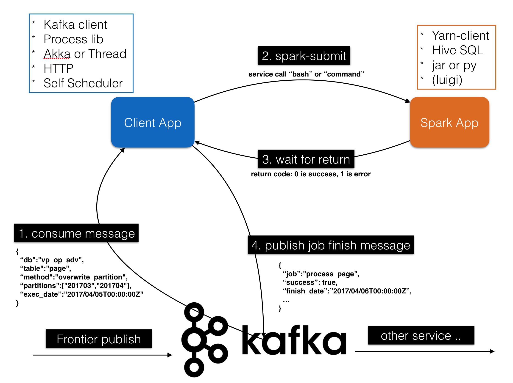

# PyPubSub

## app
### client
* app.py: client-app main file
* submitter type
  1. BasicSubmitter: basic & submit one job at a time
  2. ThreadPoolSubmitter: can submit multiple job based on max-threads
  3. FSMSubmitter: can submit job when all interested messages are received

### spark
* app.py: spark job py-file

## scripts
* Job bash file

## test
* some testing functions, like thread pool, pykka and finite state machine

## todo
* FSM waiting timer

## concept

