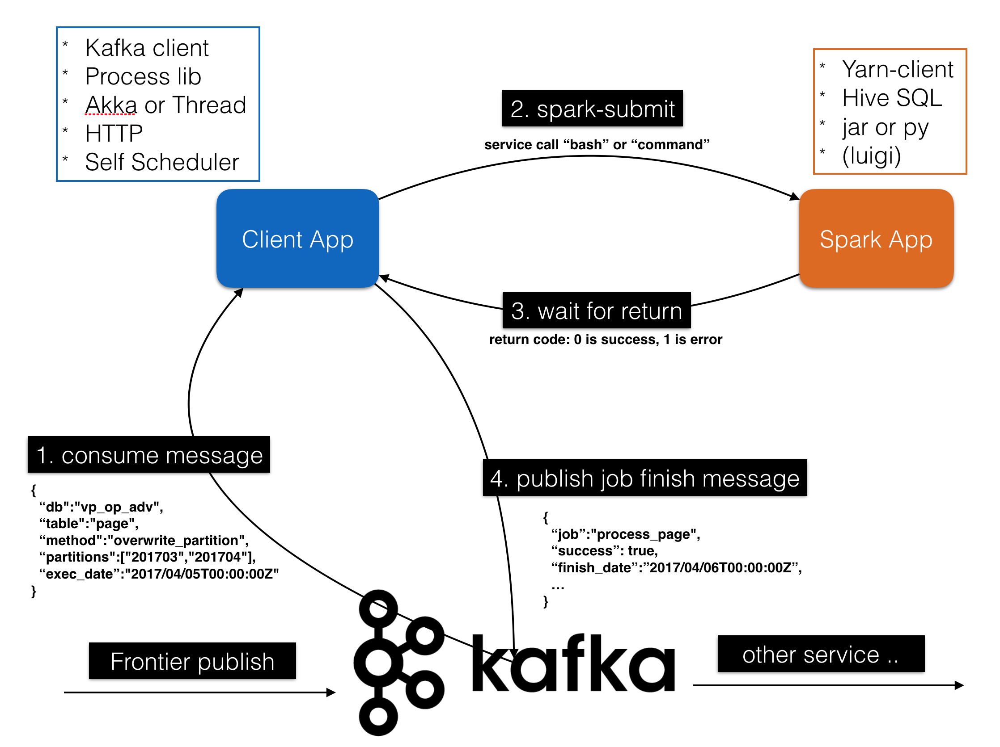

# PyPubSub

## Folder structure
### app
* submit_client.py: your message client (inherent from lib/message_client/basic/BasicClient)

### bin
* start-client.sh: start client app script
* submit-job.sh: submit spark job example script

### etc
* env.cfg: environment config

### lib
* message client library

### sbin
* entry app for bin

## How to start?
### Start Kafka Server
```
bin/zookeeper-server-start.sh config/zookeeper.properties
bin/kafka-server-start.sh config/server.properties
```

### Create Topics
```
bin/kafka-topics.sh --create --zookeeper localhost:2181 --replication-factor 1 --partitions 1 --topic frontier-adw
bin/kafka-topics.sh --create --zookeeper localhost:2181 --replication-factor 1 --partitions 1 --topic hippo-finish
```

### Start 'hippo-finish' Consumer
```
bin/kafka-console-consumer.sh --bootstrap-server localhost:9092 --topic hippo-finish --from-beginning --zookeeper localhost:2181

```

### Start 'frontier-adw' Publisher
```
bin/kafka-console-producer.sh --broker-list localhost:9092 --topic frontier-adw
```

### Start Submit Client (in App folder)
```
./bin/start-client.sh env
```

### Send test message (in console-producer)
```
{"message": "submit", "value": 1000}
```

### See if finish message is showed up (in console-consumer)
```
{"finish_time": 1507194374, "is_success": true, "num": "1000", "hippo_name": "test.submit", "job_name": "test-submit"}
```

## concept

